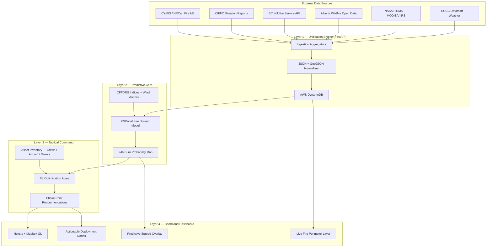

# FireGrid — Systems Architecture

## Overview

FireGrid is a B2G (Business-to-Government) tactical command platform that unifies Canada's historically fragmented wildfire intelligence pipeline. The system ingests disparate public data feeds from federal, provincial, and satellite sources, fuses them in real time, and exposes AI-driven tactical recommendations to incident commanders through a geospatial command dashboard.

The architecture is composed of **four decoupled layers**: Data Ingestion → Predictive Core → Tactical Command → Command Dashboard.

---

## System Diagram



---

## Layer 1 — Unification Engine (Data Ingestion)

**Purpose:** Aggregate, normalize, and centralize all disparate wildfire telemetry into a single low-latency store.

| Source | Data Provided | Format |
|---|---|---|
| CWFIS / NRCan Fire M3 | CFFDRS indices, national hotspots | JSON / GeoJSON |
| CIFFC | National resource mobilization status | JSON |
| BC Wildfire Service (ArcGIS REST) | Active perimeters, incidents, weather stations | GeoJSON |
| Alberta Wildfire Open Data (ArcGIS REST) | Provincial fire polygons | GeoJSON |
| NASA FIRMS API | MODIS / VIIRS satellite hotspot telemetry | CSV / JSON |
| ECCC Datamart | Wind speed/direction, temperature, humidity | XML / JSON |

**Implementation:**
- FastAPI background tasks poll all external APIs on a configurable schedule (e.g., every 5 minutes).
- Raw feeds are normalized into a unified `FireEvent` schema via `src/ingestion/`.
- Normalized records are stored in **AWS DynamoDB** for single-digit millisecond retrieval.

---

## Layer 2 — Predictive Core (XGBoost Spread Model)

**Purpose:** Predict where a fire will spread in the next 24 hours, outputting a probabilistic Burn Probability Map.

**Inputs:**
- Live meteorological vectors (wind speed, direction, humidity, temperature) from ECCC
- CFFDRS fire danger indices (FWI, ISI, BUI) from CWFIS
- Historical topography and vegetation density (static GeoTIFF layers)
- Current fire perimeter geometry

**Model:** `XGBoost` gradient boosted trees trained on historical Canadian wildfire spread data.

**Output:** A GeoJSON grid of `(lat, lon) → burn_probability` values representing the 24-hour spread forecast, stored back to DynamoDB and served via a FastAPI endpoint.

---

## Layer 3 — Tactical Command (RL Optimization Agent)

**Purpose:** Given the predicted fire spread, allocate finite interagency assets to optimal geographic choke points to maximize containment rate and minimize acreage lost.

**Framing:** Asset deployment is modelled as a **portfolio optimization problem** — maximize expected containment coverage subject to constraints on available resources.

**Inputs:**
- 24h Burn Probability Map (from Layer 2)
- Current asset inventory (hotshot crews, water bombers, bulldozers, their locations and availability)

**Model:**
- **MVP:** Greedy heuristic allocator — rank candidate choke points by `burn_probability × perimeter_vulnerability`, assign assets greedily.
- **V2:** Deep Reinforcement Learning agent (`ray[rllib]`) trained in a simulated fire environment.

**Output:** A ranked list of `ChokepointRecommendation` objects (`lat`, `lon`, `asset_type`, `priority_score`), surfaced to the dashboard as glowing deployment nodes.

---

## Layer 4 — Command Dashboard (Frontend)

**Stack:** Next.js (TypeScript) + Mapbox GL JS, dark-mode interface.

**Key Layers:**
1. **Live Fire Perimeter** — pulled from DynamoDB, rendered as a red polygon overlay.
2. **Predictive Spread Overlay** — XGBoost burn probability heatmap for the next 24h.
3. **Deployment Nodes** — RL agent choke points rendered as glowing, colour-coded action markers.

---

## Data Flow Summary

```
External APIs → Ingestion Aggregators → DynamoDB
                                           ↓
                                   XGBoost Spread Model → Burn Probability Map
                                                                    ↓
                                                       RL Tactical Agent → Choke Point Nodes
                                                                                    ↓
                                                                       Mapbox GL Dashboard
```

---

## Tech Stack Reference

| Layer | Technology |
|---|---|
| Language | Python 3.12+ |
| Package Manager | `uv` + `pyproject.toml` |
| API Framework | FastAPI |
| Database | AWS DynamoDB (`boto3`) |
| ML — Spread Prediction | `xgboost`, `scikit-learn`, `pandas`, `geopandas` |
| RL — Tactical Command | `ray[rllib]` (or greedy heuristic for MVP) |
| Geospatial | `geopandas`, `shapely`, Mapbox GL JS |
| Frontend | Next.js (TypeScript), Mapbox GL JS |
| Package Manager (Frontend) | `pnpm` |
